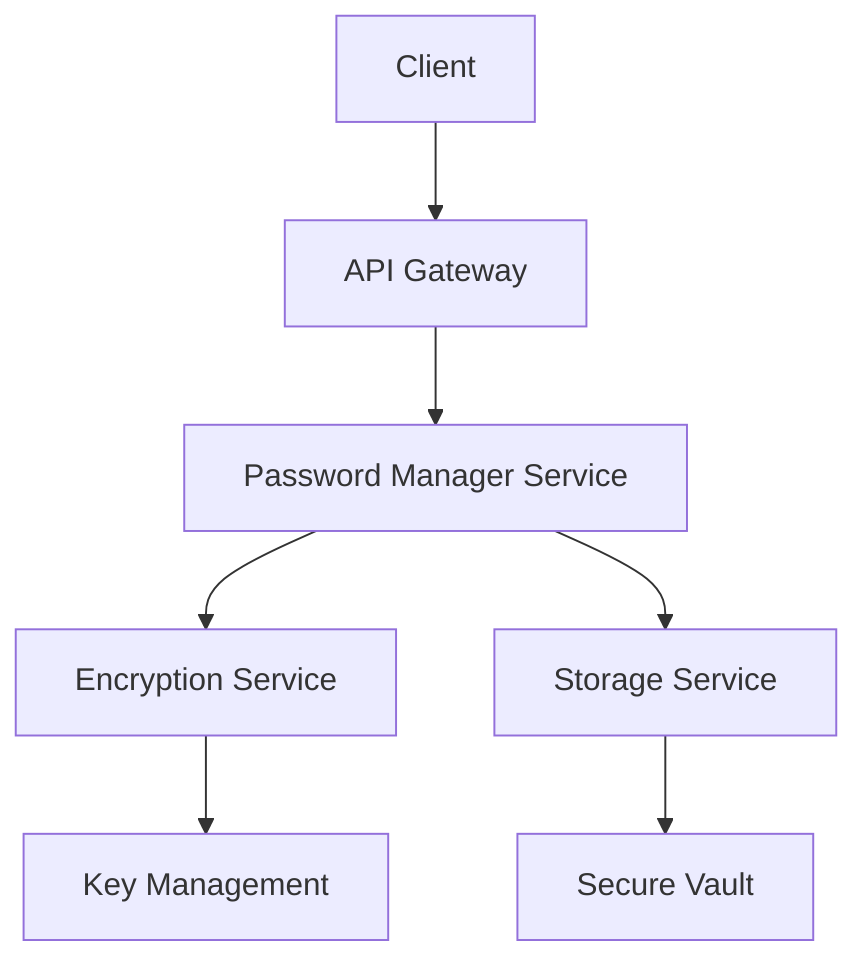

# Personal Password Manager

A secure, enterprise-grade password management solution with robust encryption and comprehensive security features.

## Architecture Overview



## Features

- Secure password generation
- End-to-end encryption
- Multi-factor authentication
- Audit logging
- Secure sharing capabilities

## Development

### Prerequisites

- Node.js 18+
- npm 8+
- Docker (for containerization)

### Setup

```bash
# Install dependencies
npm install

# Run tests
npm test

# Build
npm run build

# Start development server
npm run dev
```

### CI/CD Pipeline

Our pipeline ensures code quality and security through:

1. **Linting**: ESLint with security rules
2. **Testing**: Jest with 100% coverage requirement
3. **Security Scans**: 
   - npm audit
   - SonarQube SAST
   - Dependabot updates
4. **Build & Package**:
   - UMD/CJS/ESM bundles
   - Docker image
5. **Deployment**:
   - GitHub Container Registry
   - Automated rollback on failure

### Metrics & Monitoring

Key metrics tracked:

- `pm.vault.create.duration.p95`
- `pm.password.generate.count`
- `pm.storage.encryption.failures`

### Emergency Procedures

#### Rollback Process

1. Access the deployment dashboard
2. Locate the failing deployment
3. Execute rollback:
   ```bash
   kubectl rollout undo deployment/password-manager
   ```
4. Verify service health
5. Notify stakeholders via Slack

## License

MIT
